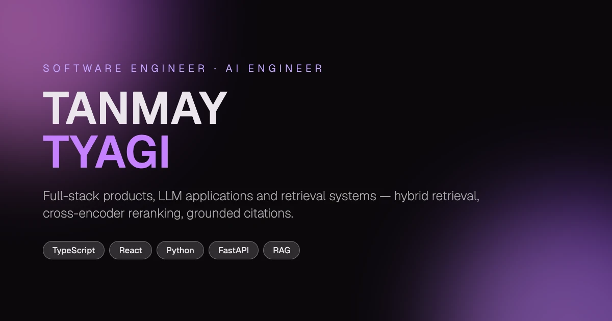

<div align="center">



# TANMAY TYAGI — 3D Interactive Portfolio

**An animation-driven developer portfolio built around a real-time 3D character.**
React and TypeScript for the structure, GSAP for the scroll choreography, Three.js for the scene —
with engineering work, published research and problem-solving presented as one continuous experience
rather than a list of links.

<br>

### [**→ View the live site**](https://tanmaytyagi-portfolio.vercel.app/)

<br>

[](https://react.dev)
[](https://www.typescriptlang.org)
[](https://vitejs.dev)
[](https://threejs.org)
[](https://gsap.com)
[](LICENSE)

</div>

---

## Contents

[Overview](#overview) · [Preview](#preview) · [Why it was built this way](#why-it-was-built-this-way) · [Features](#features) · [Tech stack](#tech-stack) · [Project structure](#project-structure) · [Site structure](#site-structure) · [Animation and 3D architecture](#animation-and-3d-architecture) · [Engineering notes](#engineering-notes) · [Quick start](#quick-start) · [Customization](#customization) · [Fork and customize](#fork-and-customize) · [Deployment](#deployment) · [Featured work](#featured-work) · [Research](#research) · [Contributing](#contributing) · [License](#license)

---

## Overview

This is the source for my personal portfolio. It is a single-page React application: one continuous
scroll where a Three.js character sits alongside the content and reacts to where you are on the page,
while GSAP's `ScrollSmoother`, `ScrollTrigger` and `SplitText` drive the transitions between sections.

Two things make it worth reading as a codebase rather than just visiting:

- **Every piece of personal content is data, not markup.** Name, links, career, projects,
  certifications and the entire research section live in two typed files under `src/data/`.
  Components render whatever is there. Forking and personalizing it is an editing job, not a
  refactoring job.
- **The expensive parts are gated, not shipped by default.** The physics-driven tech-stack canvas,
  the WebGL research chart and the character model are each lazy-loaded and each render only where
  they make sense — which the production build output shows as separate chunks.

## Preview

The 3D character, the pinned horizontal work section and the scroll choreography do not survive a
static image. **[The live site](https://tanmaytyagi-portfolio.vercel.app/) is the preview.**

The banner at the top of this README is the site's social card (`public/og.webp`). If you fork this
project, replace that file with your own and the link previews follow automatically.

## Why it was built this way

A portfolio has about five seconds to be worth scrolling. The decisions below all come from that
constraint.

| Decision | Reason |
| --- | --- |
| **A 3D character instead of a hero image** | The model tracks the cursor, plays a typing animation and rotates as you scroll. It is the one element that makes the page feel authored rather than templated. |
| **GSAP `ScrollSmoother` over native scrolling** | Camera moves, character rotation and section reveals all have to stay in step on the same timeline. Smoothed scroll gives that timeline a stable input to scrub against. |
| **`SplitText` for headings and paragraphs** | Per-character and per-word reveals tie text entry to the same scroll position as everything else, so nothing arrives on its own schedule. |
| **A pinned horizontal work section** | Projects deserve side-by-side comparison. Pinning the section and translating the track converts vertical scroll into horizontal travel without a nested scroll container. |
| **Centralized data in `src/data/`** | Content changes far more often than layout. Separating the two means updating a project never means touching a component. |
| **Plain CSS, one file per section** | No framework layer between the animation code and the styles it mutates. GSAP writes to real properties on real selectors. |
| **Desktop/mobile capability gating** | WebGL physics and a 3D chart are the right call on a laptop and the wrong one on a phone. Both are conditionally rendered, and the research chart also has a 2D fallback carrying identical data. |

## Features

**Interaction**

- Smoothed scrolling with GSAP `ScrollSmoother`, with navigation links scrubbing to sections
- Scroll-triggered timelines driving camera position, character rotation and section reveals
- `SplitText` character- and word-level typography animations, re-split on resize
- Pinned horizontal project track that re-measures itself on viewport and zoom changes
- Real-time 3D character with cursor and touch tracking, head/neck follow and idle animations
- Physics-driven tech-stack canvas (Rapier + N8AO ambient occlusion)
- Interactive 3D research matrix with an orbit-controlled bar chart and per-metric detail
- Custom cursor and a magnetic social-link rail
- Loading screen wired to real asset progress, gating the intro animation

**Engineering**

- React 18 + TypeScript in `strict` mode, with `noUnusedLocals` and `noUnusedParameters` on
- Component-per-section architecture with co-located CSS
- Data-driven rendering from two typed content modules
- Route-free code splitting via `React.lazy` and dynamic `import()`
- DRACO-compressed 3D geometry with a locally served decoder
- Explicit GSAP lifecycle management — `useGSAP` scoping, timeline teardown and pin-spacer cleanup
- ESLint 9 flat config with `typescript-eslint` and the React Hooks plugin

**Portfolio content**

- Six projects with verified metrics, stacks and source links
- Published research section rendered from the paper's own tables
- Career timeline, certifications and a problem-solving profile across four platforms
- Contact section and social rail driven by a single `links` object

## Tech stack

| Layer | Used |
| --- | --- |
| **Core** | React 18.3, TypeScript 5.5, Vite 5.4 |
| **Animation** | GSAP 3.13 — `ScrollTrigger`, `ScrollSmoother`, `SplitText` — and `@gsap/react` (`useGSAP`) |
| **3D** | Three.js 0.168, `three-stdlib` (`GLTFLoader`, `DRACOLoader`), `@react-three/fiber`, `@react-three/drei` |
| **Physics & post-processing** | `@react-three/rapier`, `@react-three/postprocessing` (N8AO) |
| **Styling** | Plain CSS with custom properties, one stylesheet per section |
| **UI details** | `react-icons`, `react-fast-marquee` |
| **Tooling** | ESLint 9 (flat config), `typescript-eslint`, TypeScript project references |
| **Hosting** | Vercel (static Vite build, zero configuration) |

## Project structure

```
.
├── public/
│   ├── draco/                  # DRACO decoder (js + wasm), served locally — no CDN dependency
│   ├── images/                 # tech-sphere textures and project cards (WebP)
│   ├── models/
│   │   ├── character.enc       # AES-encrypted, DRACO-compressed GLB
│   │   ├── char_enviorment.hdr # HDR environment map for the character lighting
│   │   └── encrypt.cjs         # build-time helper that produces character.enc
│   ├── favicon.svg
│   └── og.webp                 # social card / README banner
│
├── src/
│   ├── components/
│   │   ├── Character/          # Three.js scene, isolated from the React tree
│   │   │   ├── Scene.tsx       # renderer, camera, render loop, event wiring
│   │   │   └── utils/          # loader, lighting, animations, pointer tracking, resize, decrypt
│   │   ├── styles/             # one CSS file per section
│   │   ├── utils/
│   │   │   ├── GsapScroll.ts   # scroll timelines coupling the character to the page
│   │   │   ├── initialFX.ts    # intro sequence, run once after loading completes
│   │   │   └── splitText.ts    # SplitText setup, re-run on resize and ScrollTrigger refresh
│   │   └── *.tsx               # Landing, About, WhatIDo, Career, Research, Work,
│   │                           # TechStack, Credentials, Contact, Navbar, Cursor, …
│   │
│   ├── context/
│   │   └── LoadingProvider.tsx # loading state shared between the 3D scene and the loader UI
│   │
│   ├── data/
│   │   ├── profile.ts          # ← identity, about, skills, career, projects, certifications
│   │   ├── research.ts         # ← paper content, metrics, findings, methodology
│   │   └── boneData.ts         # bone names driving the character's typing animation
│   │
│   ├── App.tsx                 # lazy boundaries for the scene and the page
│   ├── main.tsx                # React entry point
│   └── index.css               # design tokens, font, global resets
│
├── eslint.config.js
├── index.html                  # document head: title, description, Open Graph, Twitter card
├── tsconfig.json               # project references → tsconfig.app.json + tsconfig.node.json
└── vite.config.ts
```

The two directories that matter when forking are **`src/data/`** (all content) and
**`src/components/styles/`** (all visual styling). The rest can usually stay as it is.

## Site structure

Sections render in this order inside `MainContainer.tsx`:

| Section | Component | What it holds |
| --- | --- | --- |
| Loading | `Loading.tsx` | Progress tied to real 3D asset loading; gates the intro animation |
| Hero | `Landing.tsx` | Name, rotating role pair, and the 3D character on desktop |
| About | `About.tsx` | Short professional summary |
| What I Do | `WhatIDo.tsx` | Three disciplines — engineering, applied AI, fundamentals — with their tags |
| Career | `Career.tsx` | Education and internships on an animated timeline |
| Research | `Research.tsx` | Published paper: narrative, methodology, metrics, findings, architecture comparison |
| Work | `Work.tsx` | Six projects in a pinned horizontal track |
| Tech Stack | `TechStack.tsx` | Physics canvas of technology spheres (desktop only) |
| Credentials | `Credentials.tsx` | Certifications and problem-solving profiles |
| Contact | `Contact.tsx` | Email and location |

Persistent across all of them: `Navbar` (smooth scroll-to-section), `SocialIcons` (magnetic rail of
seven links) and `Cursor` (custom cursor).

## Animation and 3D architecture

The most interesting code in the repository is the coupling between GSAP and Three.js. Neither
"owns" the page — GSAP scrubs values, and the Three.js render loop reads them each frame.

**GSAP layer**

- `ScrollSmoother` is created once in `Navbar.tsx` and exported as a module-level `smoother`, so the
  intro sequence and navigation can pause, resume and scroll it. It starts paused and is released
  only when the loading screen finishes.
- `GsapScroll.ts` builds the timelines that tie the page to the scene: as the hero gives way to the
  about section it pulls the camera back to `z: 75`, rotates the character, raises the monitor mesh
  into frame and fades the emissive screen light in — all scrubbed against scroll position rather
  than played on a timer.
- `splitText.ts` splits every `.title` and `.para` into characters and words, and re-splits on
  resize. Each pass reverts the previous split and kills the previous animation first, so repeated
  refreshes cannot stack duplicate DOM or duplicate tweens.
- Mobile takes a different path entirely: `setSplitText` returns early below 900px, and
  `setCharTimeline` builds a much smaller timeline below 1024px.

**The pinned work section**

`Work.tsx` is the clearest example of the lifecycle care this kind of page needs:

- Travel distance is computed from the sum of card widths, not `scrollWidth` — the track carries
  `calc(50000vw)` hairline pseudo-elements that would otherwise poison the measurement.
- The distance is passed as a **function** with `invalidateOnRefresh`, so ScrollTrigger re-derives
  it on refresh instead of freezing the value captured at mount.
- Because ScrollTrigger restores its pin snapshot on refresh, a viewport change **tears down and
  rebuilds** the trigger rather than refreshing it, restoring the element's pre-pin inline style
  verbatim on the way out.
- Orphaned `pin-spacer` wrappers left behind by a killed trigger are unwrapped before pinning again
   — nesting one inside another makes every later section lay out against a stale height.
- A `ResizeObserver` catches width changes with no resize event behind them (zoom, scrollbar
  appearing, webfont landing), debounced and guarded on the measured width so a rebuild cannot
  retrigger itself.

**Three.js layer**

- The character is a DRACO-compressed GLB, AES-CBC encrypted at rest as `character.enc` and
  decrypted in the browser with the Web Crypto API before it reaches `GLTFLoader`. The decoder is
  served from `public/draco/`, so there is no third-party CDN in the critical path.
- `renderer.compileAsync()` pre-compiles shaders before the first frame, and the DRACO loader is
  disposed once decoding is done.
- Loading progress is reported into `LoadingProvider`, which holds the loading screen until the
  scene is genuinely ready — the intro then runs once.
- Pointer and touch input drive head and neck bones through interpolated targets rather than direct
  assignment, which is what keeps the tracking soft instead of snapping.
- The scene lives outside `#smooth-content` on desktop so `ScrollSmoother`'s transform never applies
  to the canvas; below 1024px it is rendered inside the hero instead.

**React integration**

- `useGSAP` with a `scope` handles the common cleanup case; the work section adds its own teardown
  on top for the pin state GSAP does not fully unwind.
- `App.tsx` lazy-loads the character scene and the page shell separately, so the 3D bundle never
  blocks first paint.
- `initialFX.ts` is dynamically imported by the loading screen — the intro code is not in the
  initial bundle at all.

## Engineering notes

Verifiable from the repository and the build output — no benchmark claims are made here.

- **Code splitting is real, not theoretical.** `npm run build` emits separate chunks for the page
  shell, the navbar/`ScrollSmoother` bundle, `ScrollTrigger`, the Three.js core, the research
  matrix, the tech-stack canvas and the intro effects.
- **The heaviest chunk never reaches a phone.** The physics canvas (Rapier WASM +
  post-processing) is by far the largest artifact, and it is both lazy-loaded and gated behind
  `window.innerWidth > 1024`.
- **The research chart respects `prefers-reduced-motion`.** `Research.tsx` checks both
  `(min-width: 769px)` and `(prefers-reduced-motion: reduce)` before mounting the WebGL matrix, and
  renders `ResearchMatrix2D` — same numbers, same reading — otherwise.
- **Geometry is compressed.** The GLB is DRACO-compressed and the decoder is vendored locally.
- **Images are WebP throughout**, including the project cards and the social card.
- **Type checking gates the build.** `npm run build` runs `tsc -b` across both project references
  before Vite is invoked, so a type error fails the build rather than shipping.
- **Animation cleanup is explicit.** Split text reverts before re-splitting, timelines are killed on
  teardown, the DRACO loader is disposed after use, and pin spacers are unwrapped before re-pinning.

## Quick start

**Prerequisites**

- **Node.js 18.18+** (20 LTS or newer recommended) — Vite 5 requires `^18.0.0 || >=20.0.0` and
  ESLint 9 requires `^18.18.0 || ^20.9.0 || >=21.1.0`
- **npm 9+** (any package manager works; a `package-lock.json` is committed)

**Run it**

```bash
git clone https://github.com/tanmaytyagii/tanmaytyagi-portfolio.git
cd tanmaytyagi-portfolio

npm install       # or: npm ci — installs exactly what the lockfile pins
npm run dev       # http://localhost:5173 — also exposed on your LAN via --host
```

**Build and preview**

```bash
npm run build     # tsc -b (type check) && vite build → dist/
npm run preview   # serve dist/ locally to verify the production bundle
```

**Scripts**

| Script | What it does |
| --- | --- |
| `npm run dev` | Vite dev server with HMR, bound to `--host` so you can test on a phone on the same network |
| `npm run build` | Type-checks with `tsc -b`, then produces the optimized bundle in `dist/` |
| `npm run preview` | Serves the built `dist/` locally |
| `npm run lint` | ESLint across the project |

> **Note:** the 3D character is served as an encrypted `.glb`. If you replace it, regenerate
> `public/models/character.enc` with `public/models/encrypt.cjs` and keep the passphrase in
> `src/components/Character/utils/character.ts` in sync. This is asset packaging, not security —
> anything decrypted in a browser is readable by whoever loads the page.

## Customization

Content is deliberately separated from components. **In almost every case you are editing
`src/data/`, not `src/`.**

### `src/data/profile.ts` — everything personal

| Export | Controls | Appears in |
| --- | --- | --- |
| `identity` | First/last name, initials, location, email, and the `links` object (GitHub, LinkedIn, Codolio, LeetCode, CodeChef, X) | Hero, navbar, social rail, contact, problem solving |
| `identity.resumeUrl` | Optional résumé link. Drop a PDF at `public/resume.pdf` and set this to `"/resume.pdf"`; left empty it is simply not rendered | Bottom-right corner |
| `about` | Section title and body paragraph | About |
| `disciplines[]` | Three columns of `{ title, description, tags[] }` | What I Do |
| `career[]` | `{ role, organisation, period, summary }` entries on the timeline | Career |
| `projects[]` | Full project records — summary, `metrics`, `pipeline`, `tech[]`, `image`, `github`, `live`, `featured` | Work |
| `certifications[]` | `{ name, issuer }` | Credentials |
| `problemSolving` | Platform cards, and an optional `stats[]` grid that renders itself only when non-empty | Credentials |
| `techStack[]` | Texture paths for the physics spheres | Tech Stack |

### `src/data/research.ts` — the research section

`paper` (title, venue, authors, repo link, personal contribution), `narrative[]`, `methodology[]`,
`metrics[]`, `findings[]`, `confusionMatrix`, `architectures[]`, `losses[]` and `implementation`.
The 3D matrix and its 2D fallback both read `metrics[]`, so changing a number updates both.

If you have no paper to show, delete `<Research />` from `MainContainer.tsx` and the section is gone.

### Assets and metadata

| What | Where |
| --- | --- |
| Project card images | `public/images/work/` — referenced by `projects[].image` |
| Technology sphere textures | `public/images/` — referenced by `techStack[]` |
| Social card / README banner | `public/og.webp` (1200×630) |
| Favicon | `public/favicon.svg` |
| 3D character | `public/models/character.enc` (+ `char_enviorment.hdr` for lighting) |
| Page title, description, Open Graph and Twitter tags | `index.html` |
| Colors and type | `src/index.css` — `--accentColor`, `--backgroundColor`, and the `Geist` font import |

## Fork and customize

A realistic path from fork to deployed site:

1. **Fork** this repository, then clone your fork.

   ```bash
   git clone https://github.com/<your-username>/<your-repo>.git
   cd <your-repo>
   npm install
   npm run dev
   ```

2. **Rewrite `src/data/profile.ts`.** Start with `identity` — name, initials, location, email and
   every entry in `links`. That single object feeds the hero, navbar, social rail and contact
   section at once.

3. **Replace `about`, `disciplines`, `career` and `certifications`** with your own. The layouts adapt
   to the number of entries; there is no hard-coded count to chase down.

4. **Replace `projects[]`.** Each project needs at minimum `id`, `name`, `category`, `summary`,
   `tech[]`, `image` and `github`. Add `live` for a demo link, `featured: true` plus `metrics` and
   `pipeline` for the expanded card. Drop matching WebP images into `public/images/work/`.

5. **Handle `src/data/research.ts`** — either replace its contents with your own work, or remove
   `<Research />` from `MainContainer.tsx`.

6. **Swap the assets you want to own:** `public/og.webp`, `public/favicon.svg`, and the metadata in
   `index.html`. Retheme via `--accentColor` and `--backgroundColor` in `src/index.css`.

   > **Do not assume the bundled media is yours to redeploy.** None of it is covered by this
   > project's license. In particular, the included 3D character/model assets may be subject to
   > separate licensing terms — **replace these assets when creating a derivative portfolio unless
   > you have the necessary rights**, or remove the character scene entirely. The same applies to
   > the HDR environment map, the technology logo textures (trademarks of their owners) and the
   > project card images. See [LICENSE](LICENSE) and [NOTICE.md](NOTICE.md) before you publish.

7. **Verify** before you ship:

   ```bash
   npm run build
   npm run preview
   ```

8. **Deploy** — see below.

## Deployment

The build output is a fully static `dist/`, so any static host works. The live site runs on Vercel.

**Vercel**

1. Push your fork to GitHub.
2. In Vercel, **Add New → Project** and import the repository.
3. Vercel detects Vite and fills in the build settings itself:

   | Setting | Value |
   | --- | --- |
   | Framework preset | Vite |
   | Build command | `npm run build` |
   | Output directory | `dist` |
   | Install command | `npm install` |

4. **Deploy.** No environment variables are required — the project has no backend, no API keys and
   no runtime configuration.

Because it is a single-page app with no client-side router, no rewrite rules or `vercel.json` are
needed. The same `dist/` deploys unchanged to Netlify, Cloudflare Pages or GitHub Pages (set
`base` in `vite.config.ts` if you serve it from a subpath).

## Featured work

The six projects presented in the Work section, in the order they appear. Details live in
`projects[]` in [`src/data/profile.ts`](src/data/profile.ts).

| # | Project | What it is | Stack | Links |
| --- | --- | --- | --- | --- |
| 1 | **EdgeRAG** | Local-first RAG engine that scores retrieved evidence before answering, cites the passage behind every claim, and abstains when nothing supports one. Hybrid dense + BM25 retrieval with rank fusion and cross-encoder reranking. | Python, FastAPI, React, TypeScript, BM25, Cross-Encoder, Ollama | [Code](https://github.com/tanmaytyagii/EdgeRAG) · [Live](https://edgerag-production.up.railway.app) |
| 2 | **Ocasio** | Event marketplace with role-gated routes — discovery and booking for customers, dashboard and onboarding for vendors. Built during an engineering internship. | React, TypeScript, Vite, Tailwind CSS, Supabase Auth | [Code](https://github.com/tanmaytyagii/Ocasio) |
| 3 | **MoodFlix** | Mood-described film discovery. A lexicon classifier resolves a plain-language sentence to one of seven emotional states, scores its own confidence, and maps that state into TMDB genre space. | React, TypeScript, Tailwind CSS, TMDB API, Python, NLTK | [Code](https://github.com/tanmaytyagii/MoodFlix-Movie-Recommendation-System) · [Live](https://mood-flix-movie-recommendation-syst.vercel.app) |
| 4 | **Amazon Clone** | A real checkout pipeline rather than a UI clone: orders persist server-side before Stripe sees them, a signature-verified webhook confirms payment, and an order state machine advances from there. | Next.js, TypeScript, Prisma, MongoDB, Stripe, NextAuth | [Code](https://github.com/tanmaytyagii/amazon-clone-nextjs) · [Live](https://amazon-clone-nextjs-pi.vercel.app) |
| 5 | **GlobalFX Pro** | Currency desk on real ECB reference rates. Realised volatility from daily log returns, alerts that fire once per crossing, and anything uncomputable labelled unavailable rather than filled in. | JavaScript, Chart.js, ECB/Frankfurter, Service Worker, PWA | [Code](https://github.com/tanmaytyagii/GlobalFX-Pro) · [Live](https://global-fx-pro.vercel.app) |
| 6 | **Evalix AI** | Explainable résumé screening. Documents are stripped of name, gender, age and address before any model sees them, then scored against a deterministic five-dimension rubric a recruiter can audit and override, with the reason logged. | Python, FastAPI, Streamlit, Sentence Transformers, SQLite | [Code](https://github.com/rohan1460/evalix-ai) |

## Research

**Evidence-Grounded Healthcare AI: Evaluating RAG and LLM Architectures**
IEEE accepted · iSmartComp 2026 · First author · Bennett University, School of Computer Science and
Technology

A comparison of retrieval-augmented generation against standalone LLM architectures for clinical
question answering, evaluated across eight dimensions — factual accuracy, faithfulness, hallucination
rate, retrieval relevance, fluency, response diversity, computational efficiency and clinical safety.
The headline result is that retrieval buys evidence grounding and pays for it in latency and
inference cost, a trade worth making where correctness is not negotiable.

| | |
| --- | --- |
| **My contribution** | 15 research papers reviewed and annotated |
| **Paper-wide survey base** | 20 papers (2023–2025), across the author team |
| **Ownership** | Backend and AI integration; led a team of four |
| **Companion repository** | [RAG-vs-LLM-Healthcare-Research](https://github.com/tanmaytyagii/RAG-vs-LLM-Healthcare-Research) |

Every figure rendered in the Research section is transcribed from the paper's own tables — the
source references for each are documented inline in
[`src/data/research.ts`](src/data/research.ts). The portfolio links to the companion repository; the
paper itself is not distributed here.

## Contributing

Bug reports, rendering issues on devices I cannot test, and performance improvements are all welcome.
See [CONTRIBUTING.md](CONTRIBUTING.md) for the workflow and what's in scope.

If you are forking this to build your own portfolio, you do not need to contribute anything back —
just read the [license](#license) first.

## License

The original source code in this repository is released under the
**[Personal Portfolio License (PPL) v1.0](LICENSE)** — free to study, learn from and take ideas from,
but not to redeploy as your own site.

That license applies **only** to code written for this project. It grants no rights over:

- **Third-party dependencies and vendored code** — GSAP, Three.js, React, the Draco decoder and
  everything else in `package.json`. Each stays under its own license. Note that GSAP ships under
  the GSAP Standard "No Charge" License, which is not an open-source license.
- **Fonts and icon sets**, which stay under their respective licenses.
- **The bundled media** — the 3D character model, the HDR environment map, the technology logo
  textures and the project imagery. The included 3D character/model assets may be subject to
  separate licensing terms; this repository does not establish their provenance. **Replace these
  assets when creating a derivative portfolio unless you have the necessary rights.**

All of it is itemized in **[NOTICE.md](NOTICE.md)** — read that before reusing anything.

---

<div align="center">

**[Live site](https://tanmaytyagi-portfolio.vercel.app/)** ·
**[GitHub](https://github.com/tanmaytyagii)** ·
**[LinkedIn](https://linkedin.com/in/tyagitanmay)** ·
**[Email](mailto:tanmaytyagi68@gmail.com)**

</div>
